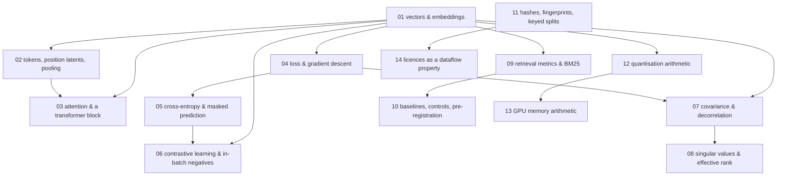

# The foundations track

Fourteen units. Each one is **one idea**, and each has the same four parts:

1. **The concept** — the real maths or computer science, stated plainly and correctly.
2. **Why CSD needs it** — the specific decision, gate or result you cannot read without it.
3. **The real code path** — a `file:line` in this repository where the idea is actually used.
4. **Try it** — a small piece of Python that runs on a CPU in under a minute and shows the idea move.

This is not a textbook and it is not a course. Every unit exists because a
[plain-track](../plain/README.md) doc leans on it. Nothing here is included for completeness.

## Reading order

Units are numbered in dependency order. Reading `01 → 14` straight through always works. If you only
want what one plain doc needs, take that doc's `depends_on_foundations` list and follow the arrows
backwards.

`11-hashing-fingerprints-and-keyed-splits` has no prerequisites and can be read at any point — it is
placed late only because that is where the plain track first needs it.

## The units

| # | unit | the idea | why it survives the cut |
|---|---|---|---|
| 01 | [Vectors, dot products, cosine — and what an embedding is](01-vectors-and-embeddings.md) | dot product, cosine similarity, a learned vector in a **shared** space | Every region's output is a vector in one space; a dot product **is** the retrieval score. Nothing else in this track parses without it. |
| 02 | [Tokens, position latents, and what pooling throws away](02-tokens-position-latents-and-pooling.md) | one hidden vector per position vs one vector per sequence; masks | "Token surface" means position latents, not ids. The programme's central bet, W1, and `DEC-47` are all statements about this distinction. |
| 03 | [Attention and a transformer block, in one page](03-attention-and-a-transformer-block.md) | Q/K/V, scaled dot-product attention, self vs cross, residual + norm + MLP | The white matter is a bounded workspace whose latents **cross-attend**, and `DEC-16` reads connection strength `a_r` **off** those attention weights. |
| 04 | [A loss, a gradient, a step, and a schedule](04-loss-and-gradient-descent.md) | loss, gradient, learning rate, schedule, held-out split | Every training objective in the plain track is a loss and every result is that loss measured on held-out data. |
| 05 | [Cross-entropy, and predicting a hidden token](05-cross-entropy-and-masked-prediction.md) | softmax, cross-entropy, masked prediction, the vocab-projection cost | `L_token` is exactly this, and the batch-1280 VRAM probe exists because the `[B,T,V]` logits tensor is what runs out of memory. |
| 06 | [Contrastive learning and in-batch negatives](06-contrastive-learning-and-in-batch-negatives.md) | InfoNCE, the batch as its own negatives, temperature | `info_nce` is how every phase-1 text region was actually trained, and it is why batch size and negative difficulty are one conversation. |
| 07 | [Covariance, correlated dimensions, and decorrelation as a loss](07-covariance-and-decorrelation.md) | covariance, off-diagonal mass, penalising redundancy | `L_decorr` is an off-diagonal penalty, and the W4 control arm measured it as ~99% of the effective-rank movement. |
| 08 | [Singular values, and how many dimensions a representation really uses](08-singular-values-and-effective-rank.md) | the spectrum; entropy-based effective rank vs participation ratio, which **disagree** | W1's pre-committed rule and W4's gate (e) are both rank comparisons. Two definitions live in `eval/benchmark.py`; you must know which produced a number. |
| 09 | [Retrieval metrics, real pools, and the BM25 you have to beat](09-retrieval-metrics-and-bm25.md) | recall@k, MRR, nDCG, AP; pool size; BM25 as an untrained lexical baseline | Gate (c) is "beat BM25" and it failed at 0.200 vs 0.440. The old 512-pair diagonal was a saturated instrument; the 57,638-passage pool is why newer numbers look worse and mean more. |
| 10 | [Baselines, control arms, and writing the threshold down first](10-baselines-controls-and-preregistration.md) | untrained baseline, chance floor, control arm, pre-registration, guards that must fail | This is the programme's whole epistemics. `DEC-36`, `DEC-62` and `DEC-68` are each a story about a missing baseline or a missing control. |
| 11 | [Hashes, fingerprints, keyed splits, and what a receipt is for](11-hashing-fingerprints-and-keyed-splits.md) | SHA-256, content addressing, HMAC, deterministic assignment mod N, receipts | `DEC-38` reserves rows by fingerprint, `DEC-39` assigns splits by `HMAC(k_split, fp) mod N` and refuses without the key, `DEC-40` hashes a checkpoint before opening it. |
| 12 | [Quantisation arithmetic: scales, codes, error, and real bytes](12-quantisation-arithmetic.md) | scale and zero point, int8/int4, round-trip error, sensitivity, packing | `quant/ptq.py` plans bit-widths from measured sensitivity, and `quant/packing.py` exists so a 4-bit claim is 4 bits of file. |
| 13 | [GPU memory arithmetic: parameters, activations, KV cache](13-gpu-memory-arithmetic.md) | parameter bytes, optimiser state, activation memory, KV-cache formula | `DEC-54` packs jobs by VRAM across three unequal cards; `DEC-63` defines episodic-store capacity as VRAM minus KV and activations; the W4 OOM is this arithmetic being violated. |
| 14 | [Licences as a property that flows: strictest input wins](14-licences-as-a-dataflow-property.md) | constraints attached to data, propagated through derivation; a strictest-input join | `DEC-31` makes the composed mind NC because GooAQ reaches `retrieve` which merges into `memory`. A reader who cannot compute that join cannot check a single licence claim. |

## What was considered and left out

Kept out because the plain track never leans on it: probability distributions beyond softmax,
optimiser internals (Adam's moments), positional-encoding variants beyond a one-line mention of RoPE,
information theory beyond the entropy used inside effective rank, and formal complexity analysis.
Two candidate units were merged rather than split: **vectors/dot products/cosine** and **embeddings
and latent spaces** became unit 01, because a plain reader meets them in the same breath and
splitting them produced a unit with no try-it of its own.

## The "try it" contract

Every try-it: pure Python with `numpy` and CPU-only `torch`, no downloads, no GPU, no dataset, and it
finishes in under a minute. It prints numbers you can compare against the text. If a try-it needs a
real corpus or a real checkpoint, it is the wrong try-it and the unit is wrong.

The units teach against the real implementation. When a `file:line` anchor in a unit no longer points
at what the text says it does, that is drift — report it per [the track chooser](../README.md).
