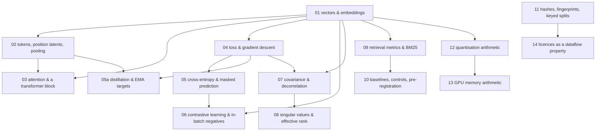

# The foundations track

**Owner:** the CSD programme operator (Tyler Zervas). **Index last verified:** 2026-09-04,
with every `file:line` anchor re-probed at `forgejo/main 4f3c098`. **Contributions:** branch
and PR, per [the track chooser](../README.md).

> **Status 2026-09-04.** This index is ratified. **The unit files are not written yet** —
> `docs/foundations/` currently holds only this README. Rows are **unlinked** until the file
> lands; a linked row means the file exists.

Fifteen units. Each one is **one idea**, and each has the same four parts:

1. **The concept** — the real maths or computer science, stated plainly and correctly.
2. **Why CSD needs it** — the specific decision, gate or result you cannot read without it.
3. **The real code path** — a `file:line` in this repository where the idea is actually used.
4. **Try it** — a small piece of Python that runs on a CPU in under a minute and shows the idea move.

This is not a textbook and it is not a course. Every unit exists because a
[plain-track](../plain/README.md) doc leans on it. Nothing here is included for completeness.

## The minimum viable path

The whole track is 15,000 words (~75 min). You almost certainly do not need all of it.

**Start with `01` and `11` — 2,100 words, ~11 min.** Neither has a prerequisite of its own, and
each is pulled by four plain docs; between them they appear in the dependency list of eight of
the thirteen.

**Then `09` → `10` — a further 2,000 words, ~10 min.** At 4,100 words total (~21 min) you have
the *complete* prerequisite set for `plain/02`, `plain/08` (which needs none), `plain/09`,
`plain/10` (which needs none) and `plain/12` — five of thirteen — and you are one unit short of
`plain/01` (needs `02`) and one short of `plain/08b` (needs `14`).

**Everything else is on demand.** Units `03`, `04`, `05`, `05a`, `06`, `07` and `14` are each
pulled by **exactly one** plain doc. Read them when that doc asks, not before. The expensive
readers are `plain/05` and `plain/06`, each of which transitively assumes seven units — about
6,800 and 6,900 words respectively, *before* their own 1,400. The [plain index](../plain/README.md)
prints that cost on every row.

## Reading order

Units are numbered in dependency order. Reading `01 → 14` straight through always works (`05a`
sits between `05` and `06`). If you only want what one plain doc needs, take that doc's
`depends_on_foundations` list and follow the arrows backwards — the graph below and the
`prerequisites` field in each unit's front matter are the **same** seventeen edges, so both
routes give the same answer.

`01-vectors-and-embeddings` and `11-hashing-fingerprints-and-keyed-splits` are the only two
units with **no** incoming arrow; `11` is placed late only because that is where the plain track
first needs it, and it can be read at any point.

## The units

Times at ~200 words a minute. **Pulled by** counts the plain docs that name the unit directly.

| # | unit | ~min | pulled by | the idea | why it survives the cut |
|---|---|---|---|---|---|
| 01 | Vectors, dot products, cosine — and what an embedding is | 6 | **4** | dot product, cosine similarity, a learned vector in a **shared** space; **parametric vs non-parametric memory** | Every region's output is a vector in one space; a dot product **is** the retrieval score. The parametric/non-parametric definition is the axis `plain/04` is built on. Nothing else in this track parses without it. |
| 02 | Tokens, position latents, and what pooling throws away | 4 | 2 | one hidden vector per position vs one vector per sequence; masks | "Token surface" means position latents, not ids. The programme's central bet, W1, and `DEC-47` are all statements about this distinction. |
| 03 | Attention and a transformer block, in one page | 5 | 1 | Q/K/V, scaled dot-product attention, self vs cross, residual + norm + MLP | The white matter is a bounded workspace whose latents **cross-attend**, and `DEC-16` reads connection strength `a_r` **off** those attention weights. |
| 04 | A loss, a gradient, a step, and a schedule | 4 | 1 | loss, gradient, learning rate, schedule, held-out split | Every training objective in the plain track is a loss and every result is that loss measured on held-out data. Anchored at `regions/pretrain.py:77/231/414/473/513/872`. |
| 05 | Cross-entropy, and predicting a hidden token | 5 | 1 | softmax, cross-entropy, masked prediction, the vocab-projection cost | `L_token` is exactly this, and the batch-1280 VRAM probe exists because the `[B,T,V]` logits tensor is what runs out of memory. |
| 05a | Learning from another model: distillation, teacher and student, and an EMA target | 5 | 1 | teacher/student, self-distillation, predict-the-representation, exponential moving average, stop-gradient | `DEC-19`'s sub-phase B is literally *distil*, and `DEC-34` deploys the **EMA target encoder** rather than the student — a sentence that does not parse until you know the target is a smoothed average of the student. Anchored at `model/vl_jepa.py:365`. |
| 06 | Contrastive learning and in-batch negatives | 5 | 1 | InfoNCE, the batch as its own negatives, temperature | `info_nce` is how every phase-1 text region was actually trained, and it is why batch size and negative difficulty are one conversation. |
| 07 | Covariance, correlated dimensions, and decorrelation as a loss | 4 | 1 | covariance, off-diagonal mass, penalising redundancy | `L_decorr` is an off-diagonal penalty, and the control arm attributed ~99% of the effective-rank movement to it **at 50 steps** — a qualifier the unit teaches you to demand, because `DEC-68` reads differently at 4,000. |
| 08 | Singular values, and how many dimensions a representation really uses | 5 | 2 | the spectrum; entropy-based effective rank vs participation ratio, which **disagree** | W1's pre-committed rule and W4's gate (e) are both rank comparisons. Two definitions live in `eval/benchmark.py`; you must know which produced a number, on which harness, at how many steps. |
| 09 | Retrieval metrics, real pools, and the BM25 you have to beat | 5 | 2 | recall@k, MRR, nDCG, AP; pool size; BM25 as an untrained lexical baseline | Gate (c) is "beat BM25" and it failed at 0.200 vs 0.440. The old 512-pair diagonal was a saturated instrument; the 57,638-passage pool is why newer numbers look worse and mean more. |
| 10 | Baselines, control arms, and writing the threshold down first | 5 | **3** | untrained baseline, chance floor, control arm, pre-registration, guards that must fail | This is the programme's whole epistemics. `DEC-36`, `DEC-62` and `DEC-68` are each a story about a missing baseline or a control run at the wrong scale. |
| 11 | Hashes, fingerprints, keyed splits, and what a receipt is for | 5 | **4** | SHA-256, content addressing, HMAC, deterministic assignment mod N, receipts | `DEC-38` reserves rows by fingerprint, `DEC-39` assigns splits by `HMAC(k_split, fp) mod N` and refuses without the key, `DEC-40` hashes a checkpoint before opening it. |
| 12 | Quantisation arithmetic: scales, codes, error, and real bytes | 6 | 2 | scale and zero point, int8/int4, round-trip error, sensitivity, packing — **and balanced ternary** | `quant/ptq.py` plans bit-widths from measured sensitivity and `quant/packing.py` makes a 4-bit claim 4 bits of file. The closing ternary section is what `plain/11`'s *trits* and §6.9's `P16` rest on: −1/0/+1 is not "int2". |
| 13 | GPU memory arithmetic: parameters, activations, KV cache | 5 | **3** | parameter bytes, optimiser state, activation memory, KV-cache formula | `DEC-54` packs jobs by VRAM across three unequal cards; `DEC-63` defines episodic-store capacity as VRAM minus KV and activations; the W4 OOM is this arithmetic being violated. |
| 14 | Licences as a property that flows: strictest input wins | 5 | 1 | constraints attached to data, propagated through derivation; a strictest-input join | `DEC-31` makes the composed mind NC because GooAQ reaches `retrieve` which merges into `memory`. Anchored at `csd-publish-checkpoint.py:158/189/263` — the table, the reason, and the refusal. |

## What was considered and left out

Kept out because the plain track never leans on it: probability distributions beyond softmax,
optimiser internals (Adam's moments), positional-encoding variants beyond a one-line mention of RoPE,
information theory beyond the entropy used inside effective rank, and formal complexity analysis.
Two candidate units were merged rather than split: **vectors/dot products/cosine** and **embeddings
and latent spaces** became unit 01, because a plain reader meets them in the same breath and
splitting them produced a unit with no try-it of its own.

**Deliberately taught inline instead of as a unit**, with the plain doc carrying an explicit
gloss requirement: comparing two distributions (KL / Jensen-Shannon) for `plain/07`'s `D_sched`,
and the inverse-Simpson `N_eff` for `plain/08`'s balance rules. Both are one idea in one
sentence at the level a non-specialist needs, and neither earns a thousand words. If either
starts being leaned on twice, it becomes a unit.

## The "try it" contract

Every try-it: pure Python with `numpy` and CPU-only `torch`, no downloads, no GPU, no dataset, and it
finishes in under a minute. It prints numbers you can compare against the text. If a try-it needs a
real corpus or a real checkpoint, it is the wrong try-it and the unit is wrong.

The units teach against the real implementation, at a pinned revision: each unit's front matter
carries `code_revision`, the base sha its anchors were verified at (`forgejo/main 4f3c098` today).
When a `file:line` anchor no longer points at what the text says it does, that is drift — report
it per [the track chooser](../README.md).
