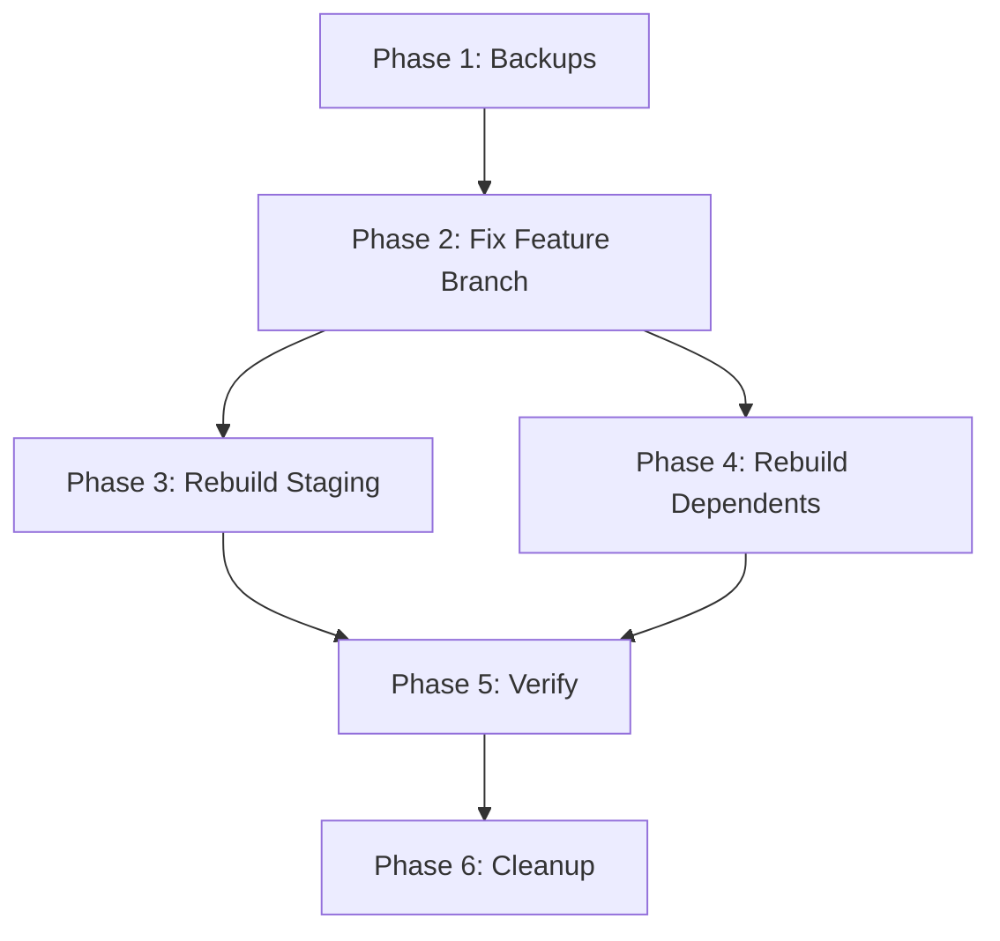

# Implementation Plan: Fix Unverified Commits

## Overview

This plan fixes unverified commits in PR #4 without breaking branch histories.

## Prerequisites

- [ ] GPG key `476C15DDFDEFF71932EA0E313470C2807DD80A2B` available and trusted
- [ ] Git configured for GPG signing (`git config commit.gpgsign true`)
- [ ] Force-push permissions on all affected branches
- [ ] No active work-in-progress on affected branches by other contributors

## Phase 1: Create Safety Backups

**Duration**: 2 minutes

```bash
cd /home/kang/Documents/projects/github/CogSynDelta

# Fetch latest
git fetch --all

# Create local backup branches
git branch backup/staging-20260118 origin/staging
git branch backup/feat-20260118 origin/feat/specs-benchmarks-logging-infrastructure
git branch backup/fix-ci-20260118 origin/fix/ci-precommit-checks

# Verify backups
git branch | grep backup
```

## Phase 2: Fix Feature Branch First

**Duration**: 5-10 minutes

The feature branch `feat/specs-benchmarks-logging-infrastructure` is the "source" branch that staging and other branches depend on. Fix this first.

### Step 2.1: Checkout and Sync

```bash
git checkout feat/specs-benchmarks-logging-infrastructure
git pull origin feat/specs-benchmarks-logging-infrastructure
```

### Step 2.2: Identify Commits to Re-sign

Find all commits after (and including) the unsigned ones:

```bash
# Find the parent of the first problematic commit
git log --oneline 9a769ec..HEAD | wc -l
# This shows how many commits need re-signing
```

### Step 2.3: Interactive Rebase with Re-signing

```bash
# Re-sign all commits from 9a769ec onwards
# Note: 9a769ec is the parent of af0c1c4

git rebase -i 9a769ec --exec "git commit --amend --no-edit -S"
```

In the interactive editor, change `pick` to `edit` for `af0c1c4` specifically to fix the author:

```
edit af0c1c4 Initial plan    # <-- Change author here
pick 97ca62e Add PCN-VAE-GAN hybrid implementation
pick 182feda Optimize exploratory phase...
... (rest remain as pick)
```

### Step 2.4: Fix af0c1c4 Author (During Rebase)

When rebase stops at `af0c1c4`:

```bash
# Amend to fix author AND sign
git commit --amend --author="Tyler Zervas <tz-dev@vectorweight.com>" -S

# Continue rebase
git rebase --continue
```

### Step 2.5: Force-Push Feature Branch

```bash
git push --force-with-lease origin feat/specs-benchmarks-logging-infrastructure
```

## Phase 3: Rebuild Staging Branch

**Duration**: 5 minutes

Staging must be rebuilt to incorporate the fixed commits.

```bash
# Checkout staging
git checkout staging

# Reset to main (the base)
git reset --hard origin/main

# Merge the fixed feature branch
git merge feat/specs-benchmarks-logging-infrastructure

# Force-push staging
git push --force-with-lease origin staging
```

## Phase 4: Rebuild Dependent Branches

**Duration**: 5 minutes

### fix/ci-precommit-checks Branch

```bash
# Checkout the fix branch
git checkout -B fix/ci-precommit-checks origin/fix/ci-precommit-checks

# Rebase onto the fixed feature branch
git rebase feat/specs-benchmarks-logging-infrastructure

# Force-push
git push --force-with-lease origin fix/ci-precommit-checks
```

## Phase 5: Verify Results

**Duration**: 5 minutes

### Step 5.1: Check Local Signatures

```bash
# Verify all commits are signed
git log --show-signature origin/staging -20

# Check for any unsigned commits
git log --format="%H %G?" origin/staging | grep -v "G$"
```

### Step 5.2: Verify on GitHub

1. Navigate to https://github.com/tzervas/CogSynDelta/pull/4
2. Check that all commits show "Verified" badge
3. Verify PR diff is unchanged

### Step 5.3: Verify CI

- Wait for CI to run on all updated branches
- Confirm all checks pass

## Phase 6: Cleanup

**Duration**: 2 minutes

Once everything is verified:

```bash
# Delete local backups
git branch -D backup/staging-20260118
git branch -D backup/feat-20260118
git branch -D backup/fix-ci-20260118

# Sync local branches
git checkout main && git pull
git checkout develop && git pull
git checkout staging && git pull
```

## Rollback Plan

If anything goes wrong:

```bash
# Restore staging from backup
git checkout staging
git reset --hard backup/staging-20260118
git push --force-with-lease origin staging

# Restore feature branch from backup
git checkout feat/specs-benchmarks-logging-infrastructure
git reset --hard backup/feat-20260118
git push --force-with-lease origin feat/specs-benchmarks-logging-infrastructure
```

## Total Estimated Time

| Phase | Duration |
|-------|----------|
| Backups | 2 min |
| Fix Feature Branch | 10 min |
| Rebuild Staging | 5 min |
| Rebuild Dependents | 5 min |
| Verification | 5 min |
| Cleanup | 2 min |
| **Total** | **~30 minutes** |

## Dependencies



## Notes

1. **Do NOT close PR #4** - it should automatically update after force-push
2. **Notify collaborators** before starting if anyone else is working on these branches
3. **Keep terminal open** with backup branch references until fully verified

## Author

Tyler Zervas (@tzervas) - January 18, 2026
