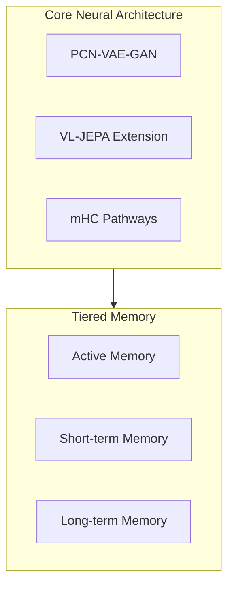

# CogSynDelta Implementation Plan - January 18, 2026

## Overview

This document outlines the implementation plan for all remaining tasks identified in the Work-in-Progress Status Report.

---

## Part 1: Commit Signing Resolution

### Decision: Accept Mixed Verification State

After analysis, the commit signing issue has two distinct cases:

| Commit | Recommendation | Rationale |
|--------|---------------|-----------|
| `af0c1c4` | **Accept as unverified** | Bot-authored commit; cannot have verified signature without falsifying authorship |
| `169f4b2` | **Accept as-is OR targeted fix** | Low priority; verified status is nice-to-have |

### Enforcing Signing Going Forward

**Action Items**:
1. ✅ GPG signing already configured (`commit.gpgsign = true`)
2. Add pre-push hook to verify signatures
3. Document signing requirements in CONTRIBUTING.md

**Implementation**:
```bash
# Add to .github/hooks/pre-push
#!/bin/bash
# Verify last commit is signed
if ! git verify-commit HEAD 2>/dev/null; then
    echo "ERROR: Commit must be GPG signed"
    echo "Run: git commit --amend -S"
    exit 1
fi
```

---

## Part 2: Documentation Cleanup & Improvements

### 2.1 Root Directory Cleanup

**Files to Archive** (move to `docs/archive/summaries/`):

| File | Action | Notes |
|------|--------|-------|
| IMPLEMENTATION_SUMMARY.md | Archive | Historical |
| PR_SUMMARY.md | Archive | Historical |
| DEPENDENCY_UPDATE_SUMMARY.md | Archive | Historical |
| COMPLETE_SUMMARY.md | Archive | Historical |
| FINAL_SUMMARY.md | Archive | Historical |
| COMMIT_SUMMARY.md | Archive | Historical |
| COMMIT_MESSAGE.txt | Archive | Template, keep if needed |
| README_IMPLEMENTATION.md | Archive | Merge into main docs |
| README_original.md | Archive | Historical |
| cpu_benchmark_results.txt | Archive → benchmark_results/ | Data file |
| quality_report.json | Archive → docs/archive/ | Historical |
| QUALITY_IMPROVEMENTS.md | Archive | Historical |
| QUICKSTART_DEPENDENCIES.md | Archive | Merge into INSTALL.md |
| RUST_REWRITE_NOTES.md | Archive | Future planning |

**Duplicates to Remove**:
| File | Keep | Remove |
|------|------|--------|
| GPU_COMPATIBILITY.md | docs/GPU_COMPATIBILITY.md | Root version |
| CONTRIBUTING.md | docs/CONTRIBUTING.md | Root version (if exists) |

### 2.2 Create Missing Essential Files

#### CODE_OF_CONDUCT.md

```markdown
# Contributor Covenant Code of Conduct

## Our Pledge

We as members, contributors, and leaders pledge to make participation in our
community a harassment-free experience for everyone...

[Use standard Contributor Covenant v2.1]
```

**Source**: https://www.contributor-covenant.org/version/2/1/code_of_conduct/

#### SUPPORT.md

```markdown
# Support

## Getting Help

- **Documentation**: [docs/](docs/)
- **Issues**: [GitHub Issues](https://github.com/tzervas/CogSynDelta/issues)
- **Security**: maintainers@vectorweight.com

## Asking Questions

1. Search existing issues first
2. Check documentation
3. Open a discussion if applicable
```

#### docs/TROUBLESHOOTING.md

```markdown
# Troubleshooting Guide

## Common Issues

### Installation
- UV installation failures
- Python 3.14 compatibility
- CUDA/GPU detection

### Runtime
- Memory errors
- GPU out-of-memory
- Import errors

### Testing
- Pytest discovery issues
- Fixture errors
```

### 2.3 Complete Spec-Driven Development Files

| Spec Directory | Missing Files |
|----------------|---------------|
| specs/compression-research/ | plan.md, tasks.md |
| specs/silent-error-logging/ | plan.md, tasks.md |

### 2.4 Add Architecture Diagrams

Convert ASCII diagrams in docs/ARCHITECTURE.md to Mermaid format:



---

## Part 3: Project Proposal Document

### Structure (Industry Standard)

1. **Executive Summary** (1 page)
   - Problem statement
   - Solution overview
   - Key differentiators

2. **Technical Overview** (3-4 pages)
   - Architecture diagram
   - Component descriptions
   - Technology stack

3. **Market Analysis** (1-2 pages)
   - Target use cases
   - Competitive landscape
   - Unique value proposition

4. **Development Roadmap** (1-2 pages)
   - Completed milestones
   - Current phase
   - Future plans

5. **Team & Organization** (1 page)
   - Average Joe's Labs (AJL)
   - Key contributors

6. **Technical Specifications** (appendix)
   - Performance benchmarks
   - API documentation
   - Requirements

### Key Messages (Grounded in Truth)

- **What it is**: PCN-VAE-GAN hybrid with VL-JEPA and mHC integration
- **What it does**: Self-improving AI architecture with tiered memory
- **Current state**: v0.2.0, production-ready core components
- **Known limitations**: Quantum features stubbed, compression fidelity at 0.67 (target >0.95)

---

## Part 4: GPU Benchmark Validation

### Environment

- **Workstation**: akula-prime
- **GPU**: NVIDIA RTX 5080 (16GB)
- **CUDA**: 12.8
- **PyTorch**: 2.9.1

### Benchmark Suite

```bash
# SSH to akula-prime
ssh kang@akula-prime

# Navigate to project
cd /path/to/CogSynDelta

# Run full benchmark suite
uv run python benchmarks/run.py --gpu --output benchmark_results/

# Run model-specific benchmarks
uv run python benchmarks/model_benchmarks.py --detailed

# Run industry comparisons
uv run python benchmarks/model_comparisons.py
```

### Expected Outputs

1. `benchmark_results/rtx5080_benchmark_results.json` - Updated
2. `benchmark_results/GPU_BENCHMARK_SUMMARY_*.md` - New summary
3. Performance comparison vs. baselines

---

## Part 5: Task Execution Order

### Immediate (Day 1)

| Priority | Task | Est. Time |
|----------|------|-----------|
| 1 | Create CODE_OF_CONDUCT.md | 15 min |
| 2 | Archive root directory files | 30 min |
| 3 | Remove duplicate files | 10 min |
| 4 | Add pre-push hook for signing | 15 min |

### Short Term (Day 2-3)

| Priority | Task | Est. Time |
|----------|------|-----------|
| 5 | Create SUPPORT.md | 20 min |
| 6 | Create docs/TROUBLESHOOTING.md | 1 hour |
| 7 | Complete spec plan.md/tasks.md | 2 hours |
| 8 | Add Mermaid diagrams | 1 hour |

### Medium Term (Day 4-7)

| Priority | Task | Est. Time |
|----------|------|-----------|
| 9 | Draft project proposal | 4-6 hours |
| 10 | Run GPU benchmarks | 2-3 hours |
| 11 | Review and merge PRs | 1 hour |
| 12 | Update CHANGELOG | 30 min |

---

## Part 6: Success Criteria

### Documentation
- [ ] Root directory has ≤10 .md files (excluding LICENSE, README)
- [ ] All essential files present (SECURITY, CODE_OF_CONDUCT, SUPPORT)
- [ ] No duplicate documentation
- [ ] All specs have plan.md and tasks.md

### Project Proposal
- [ ] Professional formatting
- [ ] No unsubstantiated claims
- [ ] Clear technical accuracy
- [ ] Ready for stakeholder review

### Benchmarks
- [ ] Updated RTX 5080 results
- [ ] Comparison with baselines
- [ ] No regressions from previous results

### Repository Health
- [ ] All CI checks passing
- [ ] GPG signing enforced
- [ ] PRs ready for merge

---

## Appendix: File Locations After Cleanup

```
/
├── AGENTS.md          # Keep
├── BENCHMARK_RESULTS.md # Keep
├── CHANGELOG.md       # Keep
├── CODE_OF_CONDUCT.md # NEW
├── INSTALL.md         # Keep
├── LICENSE            # Keep
├── MANIFEST.in        # Keep
├── README.md          # Keep
├── ROADMAP.md         # Keep
├── SECURITY.md        # Keep
├── SUPPORT.md         # NEW
├── pyproject.toml     # Keep
├── docs/
│   ├── archive/
│   │   └── summaries/ # ARCHIVED FILES
│   ├── ARCHITECTURE.md (with Mermaid)
│   ├── TROUBLESHOOTING.md # NEW
│   └── ...
└── specs/
    ├── compression-research/
    │   ├── spec.md
    │   ├── plan.md    # NEW
    │   └── tasks.md   # NEW
    └── silent-error-logging/
        ├── spec.md
        ├── plan.md    # NEW
        └── tasks.md   # NEW
```

---

*Document Version: 1.0*
*Created: January 18, 2026*
*Author: CogSynDelta Development Team*
